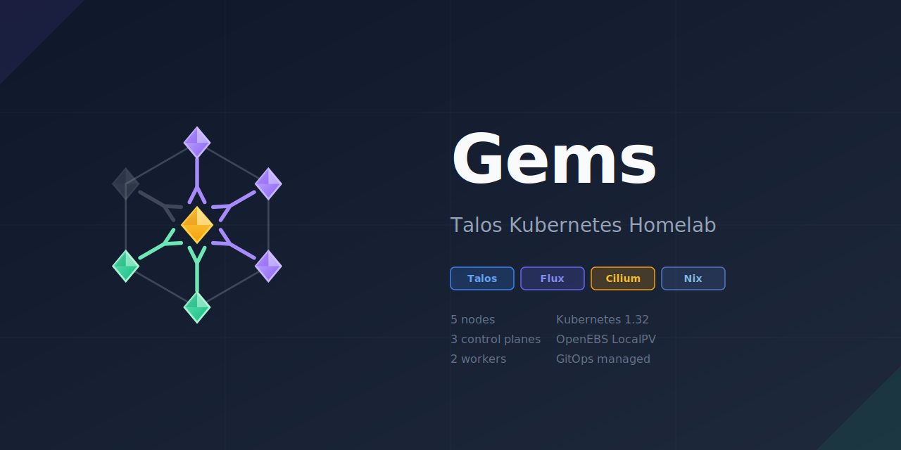

<div align="center">

<picture>
  <source media="(prefers-color-scheme: dark)" srcset="assets/social-preview.svg">
  <source media="(prefers-color-scheme: light)" srcset="assets/social-preview.svg">
  
</picture>

[](https://opensource.org/licenses/MIT)
[](https://www.talos.dev/)
[](https://kubernetes.io/)
[](https://fluxcd.io/)
[](https://cilium.io/)
[](https://nixos.org/)

</div>

## Overview

Gems is a production-grade Kubernetes homelab running on Intel NUCs with Talos Linux. It features:

- **Immutable Infrastructure** - Talos Linux provides a secure, immutable OS
- **GitOps** - Flux CD manages all cluster resources declaratively
- **Encrypted Secrets** - SOPS with age encryption for secrets in Git
- **Reproducible Tooling** - Nix flakes for consistent development environment
- **Local Storage** - OpenEBS LocalPV for persistent volumes

## Cluster Topology

```
                    ┌─────────────────┐
                    │   Cluster API   │
                    │  192.168.86.250 │
                    └────────┬────────┘
                             │
        ┌────────────────────┼────────────────────┐
        │                    │                    │
        ▼                    ▼                    ▼
┌───────────────┐   ┌───────────────┐   ┌───────────────┐
│ gem-master-0  │   │ gem-master-1  │   │ gem-master-2  │
│ Control Plane │   │ Control Plane │   │ Control Plane │
│ .250 │ 256GB  │   │ .21  │ 512GB  │   │ .31  │ 512GB  │
└───────────────┘   └───────────────┘   └───────────────┘

        ┌─────────────────────────────────┐
        │                                 │
        ▼                                 ▼
┌───────────────┐                ┌───────────────┐
│ gem-worker-0  │                │ gem-worker-1  │
│    Worker     │                │    Worker     │
│ .25  │ 256GB  │                │ .37  │ 256GB  │
└───────────────┘                └───────────────┘
```

## Prerequisites

- [Nix](https://nixos.org/download.html) with flakes enabled
- [direnv](https://direnv.net/) (optional, for automatic shell)

## Quick Start

```bash
# Enter dev shell
nix develop

# Or with direnv
direnv allow
```

## Directory Structure

```
gems/
├── apps/                    # Application workloads
│   ├── blog/                # Blog with image automation
│   ├── cloudflared/         # Cloudflare tunnel
│   └── nginx-test/          # Test deployment
├── infrastructure/          # Infrastructure components
│   └── controllers/
│       ├── cilium/          # CNI with Gateway API
│       ├── reloader/        # Config reload controller
│       └── openebs/         # Local storage provisioner
├── clusters/gems/           # Flux configuration
│   └── flux-system/
├── talos/                   # Talos OS configuration
│   ├── patches/             # Shared patches
│   ├── nodes/               # Per-node patches
│   ├── gen/                 # Generated configs (gitignored)
│   └── secrets.yaml         # SOPS encrypted secrets
├── docs/                    # Documentation
│   └── storage.md           # Storage & disk inventory
└── scripts/                 # Management scripts
```

## Bootstrap

<details>
<summary><b>1. Prepare Talos ISO</b></summary>

```bash
# Download ISO with extensions
talos-iso --latest

# Flash to USB and boot target machines
```

</details>

<details>
<summary><b>2. Generate Secrets and Configs</b></summary>

```bash
# Generate and encrypt cluster secrets (first time only)
talos-gen secrets

# Generate node configs
talos-gen configs
```

</details>

<details>
<summary><b>3. Apply First Control Plane</b></summary>

```bash
# Apply config to first control plane (insecure - no certs yet)
apply-gem-master-0 --insecure

# Bootstrap the cluster
talosctl bootstrap --talosconfig talos/gen/talosconfig -n 192.168.86.250
```

</details>

<details>
<summary><b>4. Install CNI</b></summary>

```bash
# Get kubeconfig
kubeconfig

# Apply Cilium CNI (cluster will become healthy)
kubectl apply -f infrastructure/controllers/cilium/manifests/cilium.yaml
```

</details>

<details>
<summary><b>5. Apply Remaining Nodes</b></summary>

```bash
# Apply other control planes
apply-gem-master-1
apply-gem-master-2

# Apply workers
apply-gem-worker-0
apply-gem-worker-1
```

</details>

<details>
<summary><b>6. Install Flux</b></summary>

```bash
# Create SOPS age secret for Flux decryption
kubectl create ns flux-system
sops -d clusters/gems/flux-system/age.agekey | \
  kubectl create secret generic sops-age -n flux-system --from-file=age.agekey=/dev/stdin

# Apply Flux to take over GitOps management
kubectl apply -k clusters/gems/flux-system/
```

</details>

## Day-2 Operations

### Applying Configuration Changes

```bash
# Edit patches in talos/patches/ or talos/nodes/, then:
talos-gen configs
apply-<node-name>
```

### Upgrading Talos

```bash
# Use --preserve to keep local storage data
upgrade-<node-name> <version>
```

### Upgrading Kubernetes

```bash
talosctl -n 192.168.86.250 upgrade-k8s --to <version>
```

### Rendering Helm Charts

```bash
# Render specific chart
render-helm infrastructure/controllers/cilium/helm-values.yaml

# Render all charts
render-helm --all
```

## Available Commands

| Command                    | Description                                         |
| -------------------------- | --------------------------------------------------- |
| `apply-<node>`             | Apply config to node (`--insecure` for first apply) |
| `upgrade-<node> <version>` | Upgrade Talos on node                               |
| `talos-gen secrets`        | Generate new cluster secrets                        |
| `talos-gen configs`        | Generate node configs                               |
| `talos-iso`                | Download Talos ISO with extensions                  |
| `render-helm`              | Render helm charts to manifests                     |
| `kubeconfig`               | Get kubeconfig from cluster                         |
| `nix fmt`                  | Format all files                                    |

## Nodes

| Node         | IP             | Role          | Storage     |
| ------------ | -------------- | ------------- | ----------- |
| gem-master-0 | 192.168.86.250 | Control Plane | 256 GB NVMe |
| gem-master-1 | 192.168.86.21  | Control Plane | 512 GB NVMe |
| gem-master-2 | 192.168.86.31  | Control Plane | 512 GB NVMe |
| gem-worker-0 | 192.168.86.25  | Worker        | 256 GB NVMe |
| gem-worker-1 | 192.168.86.37  | Worker        | 256 GB NVMe |

## Tech Stack

<table>
<tr>
<td align="center" width="96">

<br>Talos
</td>
<td align="center" width="96">

<br>Kubernetes
</td>
<td align="center" width="96">

<br>Flux
</td>
<td align="center" width="96">

<br>Cilium
</td>
<td align="center" width="96">

<br>Nix
</td>
</tr>
</table>

## License

This project is licensed under the MIT License - see the [LICENSE](LICENSE) file for details.
